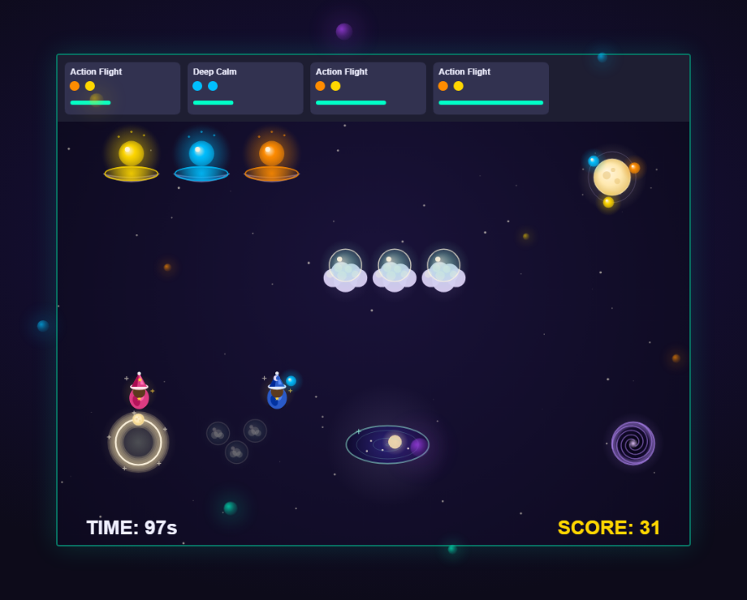
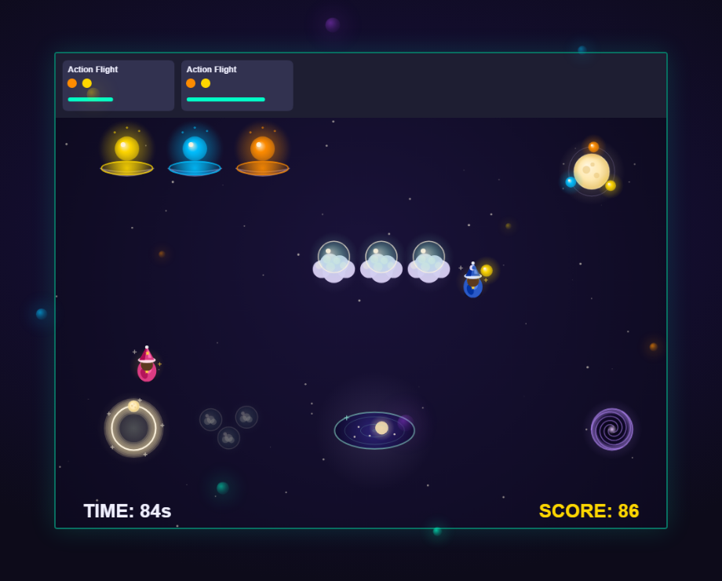

# DreamWeaver

**A co-op game about weaving dreams.** Up to four players share a dreamscape and
race the clock to craft dreams out of glowing orbs — grab, refine, weave, deliver,
repeat. It's frantic, it's cooperative, and it runs entirely in the browser.

### ▶ [Play it here](https://dream-weaver-sandy.vercel.app/)

No install, no download — just open the link and share the room code with friends.
*(The server sleeps when idle, so the first "Host a dream" click can take up to a
minute to wake it.)*



---

## Why this exists

My friends and I played a *lot* of Overcooked crammed into a dorm room in first
year. When we moved off campus the console went with a roommate, and those nights
just stopped. Nobody asked me to fix that — I just wanted them back, so I built us
our own version that anyone can play from a link.

## How to play

| Key | Action |
| --- | --- |
| **Arrow keys** | Move your dreamer |
| **Space** | Interact with the highlighted station |

Every dream is a recipe of coloured orbs. To make one:

1. **Draw an orb** from a Well — gold (joy), blue (calm), or orange (adventure).
2. **Refine it** at the Moon-Forge. Hold `Space` — *and if a friend holds it with
   you, it refines faster.*
3. **Load it onto a vessel**, and repeat until the recipe is complete.
4. **Weave it** in the Scrying Pool to turn the orbs into a finished dream.
5. **Deliver it** through the Moongate before the order expires.

Botched a vessel? Feed it to **The Void** and start clean.

## Levels

| # | Name | What's new |
| --- | --- | --- |
| ✦ | The First Weave | Guided tutorial, no timer |
| I | The First Dream | Two-orb dreams — learn the loop |
| II | The Deep Sleep | The dreamscape rearranges |
| III | The Waking Fever | Three-orb dreams |
| IV | The Restless Night | Priority orders, double points |
| V | The Fracturing | Machines **jam** and lock up |
| VI | The Nightmare | Jams *and* **surge waves** |

Difficulty scales with party size — solo gets a longer clock and calmer order
flow; four players get a tighter one. Star targets scale to match.



## Running it locally

You'll need Python 3.10+.

```bash
pip install -r requirements.txt
```

Start the game server:

```bash
python src/server.py
```

Then serve the client in a second terminal:

```bash
python -m http.server 8000 --directory web
```

Open <http://localhost:8000>. The client auto-detects localhost and connects to
`ws://localhost:5555`. To test multiplayer, open a second tab and join with the
room code.

## Architecture

```
web/            Browser client — HTML5 canvas, vanilla JS, no build step
  game.js       Entities, rendering, input, game loop, UI
  network.js    WebSocket client w/ auto-reconnect + request correlation
  audio.js      Procedural Web Audio music (nothing sampled)
  config.json   ← single source of truth, read by client AND server
src/
  server.py     Python asyncio WebSocket server — authoritative game state
```

**The server owns the simulation.** Clients send input and render; the server
holds the timer, orders, station state, and station locks (so two players can't
grab the same machine on the same frame), then broadcasts state to the room.
Clients predict locally and reconcile against those broadcasts.

**`web/config.json` is the single source of truth** for recipes, station layouts,
timings, scoring, and difficulty curves. Both the Python server and the JS client
read the same file, so they can't drift. Change gameplay values there — never
hardcode them in `server.py` or `game.js`.

**Rooms survive restarts.** Game state is snapshotted to Postgres, so a dropped
connection or a server restart drops you back where you left off.

### Stack

- **Client:** vanilla JS + HTML5 Canvas, Web Audio API — no framework, no bundler
- **Server:** Python `asyncio` + `websockets`
- **Database:** Postgres via `asyncpg` (Supabase) — optional, falls back to memory
- **Hosting:** Vercel (client) + Render (server)

## Deploying

See **[docs/DEPLOYMENT.md](docs/DEPLOYMENT.md)**.
